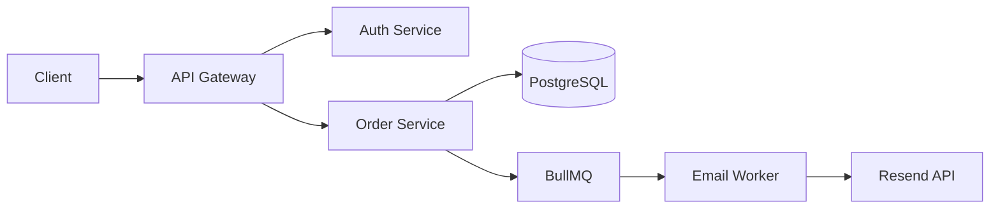
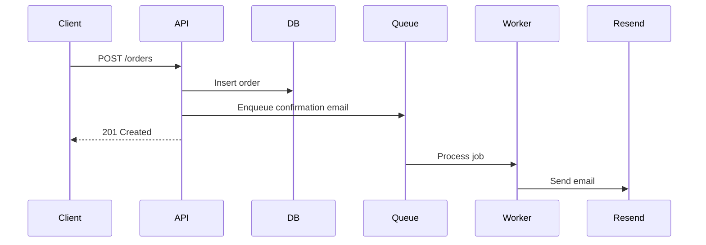

Sync documentation for $ARGUMENTS.


## Docs sync workflow

1. **Detect changes** — analyze git diff (staged + unstaged) or the specified files/feature
2. **Map changes to docs** — determine which documentation types are affected
3. **Read existing docs** — understand current documentation state before modifying
4. **Update docs** — apply minimal, accurate updates to affected documentation
5. **Flag gaps** — report documentation that should exist but doesn't (don't create without asking)

## Change-to-docs mapping

Use this matrix to determine which docs need updating:

| What changed | Docs to check |
|---|---|
| API endpoints (routes, controllers, handlers) | OpenAPI/Swagger spec, API docs, README API section |
| Request/response DTOs, validation schemas | OpenAPI spec, API docs, type docs |
| Database schema, migrations | ERD/schema diagrams, migration docs, data model docs |
| Environment variables, config | README setup section, .env.example, deployment docs |
| Dependencies (package.json, .csproj) | README prerequisites, setup instructions |
| CLI commands, scripts | README usage section, contributing guide |
| Authentication, authorization | Auth docs, API docs (auth section), security docs |
| UI components, pages, routes | Component docs, storybook, user-facing docs |
| Workflow/automation (n8n, pipelines) | Workflow docs, integration docs, runbooks |
| Infrastructure (Docker, CI/CD) | Deployment docs, README setup, architecture diagrams |
| Project structure (new dirs, major moves) | README structure section, architecture docs |

## Documentation types and how to update them

### OpenAPI / Swagger

- Location: look for `openapi.yaml`, `openapi.json`, `swagger.json`, or generated specs
- For .NET: check if using Swashbuckle/NSwag annotations — update XML comments and attributes
- For Node.js: check for Zod-to-OpenAPI, tsoa, or manual spec files
- Update: endpoints, request/response schemas, status codes, auth requirements, examples
- Never remove endpoints unless they were deleted in code

#### Detecting Endpoint Changes

When code changes touch route files, controllers, or handlers, diff the changes to detect:

1. **New endpoints**: added routes, new controller methods, new handler files
2. **Changed request/response shapes**: modified DTOs, added/removed fields, changed types
3. **Changed status codes**: new error responses, different success codes
4. **Changed auth requirements**: added/removed auth middleware, changed roles
5. **Removed endpoints**: deleted routes (mark as deprecated in spec before removing)

#### Updating OpenAPI Spec

For manual spec files (`openapi.yaml`), update in this order:

```yaml
# 1. Add/update path
/api/orders/{id}/cancel:
  post:
    summary: Cancel an order
    operationId: cancelOrder
    tags: [Orders]
    security: [{ bearerAuth: [] }]
    parameters:
      - name: id
        in: path
        required: true
        schema: { type: string, format: uuid }
    requestBody:
      required: true
      content:
        application/json:
          schema: { $ref: '#/components/schemas/CancelOrderRequest' }
          example: { reason: "Changed my mind" }
    responses:
      '200': { description: Order cancelled, content: { application/json: { schema: { $ref: '#/components/schemas/OrderResponse' } } } }
      '400': { description: Order cannot be cancelled (already shipped) }
      '404': { description: Order not found }

# 2. Add/update schema in components
components:
  schemas:
    CancelOrderRequest:
      type: object
      required: [reason]
      properties:
        reason: { type: string, minLength: 1, maxLength: 500 }
```

For annotation-driven specs (.NET Swashbuckle, NestJS @nestjs/swagger), update the controller/handler decorators and DTOs directly -- the spec regenerates from code.

#### API Client Documentation

When API changes affect SDK examples or client integration docs:
- Update request/response examples to match new shapes
- Update authentication examples if auth requirements changed
- Add migration notes for breaking changes (new required fields, removed endpoints)
- Update code snippets in Postman collections or Bruno files

### README.md

- Update only sections affected by the change
- Common sections: setup/install, prerequisites, usage, API overview, project structure, environment variables
- Keep the existing style and structure — don't reorganize
- Update version numbers, dependency lists, and command examples if they changed

### Architecture diagrams (Mermaid)

- Look for `.md` files containing ```mermaid blocks or standalone `.mmd` files
- Update: component relationships, data flow arrows, service names, database tables
- Keep diagram style consistent with existing diagrams
- If a diagram exists and is now wrong, update it. If no diagram exists, flag it but don't create one

#### Common Diagram Types and When to Update

**Architecture/Component diagrams** -- update when: new service added, service renamed, communication pattern changed, database added/removed.



**Sequence diagrams** -- update when: API flow changed, new steps in a workflow, error handling changed.



**ERD diagrams** -- update when: tables added/removed, columns changed, relationships modified.

```mermaid
erDiagram
    USER ||--o{ ORDER : places
    ORDER ||--|{ ORDER_ITEM : contains
    ORDER_ITEM }o--|| PRODUCT : references
    USER { uuid id PK; string email; timestamp created_at }
    ORDER { uuid id PK; uuid user_id FK; decimal total; string status }
```

Rules: keep diagrams small and focused (one per concern). Verify Mermaid syntax renders correctly. Use consistent naming (PascalCase for entities, camelCase for fields).

### API documentation

- Markdown API docs, Postman collections, or dedicated docs folders
- Update: endpoint descriptions, request/response examples, error codes, auth flow
- Ensure examples match the current implementation

### Changelogs

- Look for `CHANGELOG.md` or `CHANGES.md`
- If it exists and follows a format (Keep a Changelog, etc.), add an entry under `[Unreleased]`
- Include: what changed, why (link to issue/PR if available), breaking changes
- Don't create a changelog if one doesn't exist

#### Changelog Generation from Conventional Commits

When the project uses conventional commits, group entries by type:

```markdown
## [Unreleased]

### Added
- User invitation endpoint `POST /api/users/invite` (#142)
- Email notification on order cancellation (#138)

### Changed
- Order API now returns `cancelledAt` timestamp in response (#140)

### Fixed
- Race condition in concurrent order updates (#139)

### Breaking Changes
- `POST /api/orders` now requires `shippingAddress` field (#141)
```

Mapping: `feat:` -> Added, `fix:` -> Fixed, `refactor:/perf:` -> Changed, `docs:` -> skip (already a docs change), `BREAKING CHANGE:` footer -> Breaking Changes section.

Rules: one line per change, include PR/issue reference, breaking changes always get their own section at the top, keep entries user-facing (not implementation details).

### Environment and config docs

- Update `.env.example` if new env vars were added (with placeholder values, never real secrets)
- Update README setup section if config requirements changed
- Update Docker/docker-compose docs if container config changed

### Setup guide updates

When changes affect how a developer sets up or runs the project, update the relevant sections:

1. **New environment variables**: add to `.env.example` with placeholder and comment explaining what it is
2. **New dependencies**: update prerequisites section (e.g., "Requires Redis 7+" or "Install Sharp: `npm install sharp`")
3. **New build steps**: update build/run instructions (e.g., new migration command, new seed step)
4. **New external services**: update "External Services" section (e.g., "Create a Resend account at resend.com")
5. **Changed ports**: update port mapping docs and docker-compose references
6. **New CLI commands**: update "Available Scripts" or "Commands" section

Example -- new service dependency added:

```markdown
## Prerequisites
- Node.js 20+
- PostgreSQL 16+
- Redis 7+ (NEW — required for background job queue)

## Setup
1. Clone the repo
2. `cp .env.example .env.local` and fill in values
3. `docker compose up -d` (starts PostgreSQL and Redis)  <!-- updated -->
4. `npm install`
5. `npm run db:migrate`
6. `npm run dev`
```

### Automated Change Detection

Before updating docs, analyze the diff to determine scope:

```
git diff --name-only HEAD~1   # files changed in last commit
git diff --staged --name-only  # staged changes
```

Classification rules:
- `routes/`, `controllers/`, `handlers/`, `*.controller.ts`, `*.handler.ts` -> check OpenAPI spec
- `*.entity.ts`, `*.model.ts`, `migrations/` -> check ERD diagrams, data model docs
- `.env*`, `config/` -> check .env.example, README setup section
- `package.json`, `*.csproj`, `docker-compose*` -> check README prerequisites
- `Dockerfile`, `.github/workflows/` -> check deployment docs
- Any structural change (new directories, renamed modules) -> check project structure section

When multiple doc types need updating, process in this order: OpenAPI spec (contract first), then README, then diagrams, then changelog. This ensures the contract is correct before updating derived documentation.

## Example

A developer added a new `POST /api/users/invite` endpoint and a `RESEND_API_KEY` env var. Here is the docs-sync result:

Change detected: `routes/users.ts` added invite endpoint, `.env` added `RESEND_API_KEY`.

Updated `openapi.yaml` -- added the new endpoint:

```yaml
# openapi.yaml (added section)
/api/users/invite:
  post:
    summary: Send user invitation
    tags: [Users]
    requestBody:
      required: true
      content:
        application/json:
          schema:
            type: object
            required: [email, role]
            properties:
              email: { type: string, format: email }
              role: { type: string, enum: [viewer, editor, admin] }
    responses:
      '201': { description: Invitation sent }
      '400': { description: Validation error }
      '409': { description: User already exists }
```

Updated `.env.example` -- added the new variable:

```bash
# .env.example (added line)
RESEND_API_KEY=your-resend-api-key-here
```

Updated `README.md` prerequisites section -- added Resend dependency note.

## Rules

- **Read before writing** — always read the current doc state before modifying
- **Minimal changes** — only update what's affected. Don't rewrite entire documents
- **Match style** — follow the existing documentation style, formatting, and conventions
- **No phantom docs** — never document features that don't exist in code
- **No stale examples** — if you update a doc, verify code examples still work
- **Flag, don't create** — if important docs are missing entirely, tell the user. Don't create new doc files unless explicitly asked
- **Diagrams are code** — treat Mermaid/PlantUML as source code; verify syntax
- **Swagger is contract** — OpenAPI specs must exactly match implementation; use same types, enums, status codes
- **.env.example never has secrets** — only placeholder values like `your-api-key-here`

## Report Format (embed in Notes field)

When reporting docs sync results, embed the formatted report as the value of the Notes field in your Output Contract response. Do not replace the Status/Changed/Notes structure.

After syncing, report what was done:

```
📄 Docs Sync Report

Updated:
  M  docs/api.md           — added POST /users endpoint
  M  README.md             — updated prerequisites section
  M  openapi.yaml          — added UserCreateRequest schema

Flagged (missing docs):
  ⚠️  No architecture diagram exists — consider adding one for the auth flow
  ⚠️  No CHANGELOG.md — consider adding one

No changes needed:
  ✓  docker-compose.yml docs — still accurate
```
